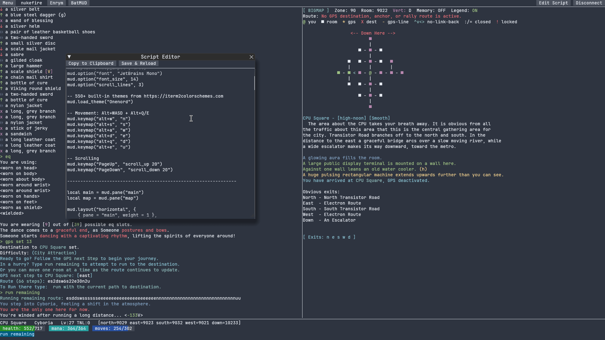

# MUDular Client

A cross-platform MUD client with Scheme scripting, built in Rust.



- Multi-tab parallel connections
- Full Scheme scripting: panes, gauges, triggers, aliases, timers, keymaps
- ANSI color (256 + truecolor), MSDP, GMCP, MCCP2, MSSP
- 550+ built-in themes from [iterm2colorschemes.com](https://iterm2colorschemes.com)
- TLS support

## Download

[Launch the web version](https://peachpearorange.github.io/MUDular-Client/) or browse the [releases](https://github.com/peachpearorange/MUDular-Client/releases).

The web version runs in the browser and currently connects to WebSocket-enabled profiles, including Enrym.

| Platform | Link |
|----------|------|
| Web | [mudular web app](https://peachpearorange.github.io/MUDular-Client/) |
| Native builds | [releases](https://github.com/peachpearorange/MUDular-Client/releases) |

## Building from source

Requires nightly Rust (edition 2024).

```
cargo build --release
```
